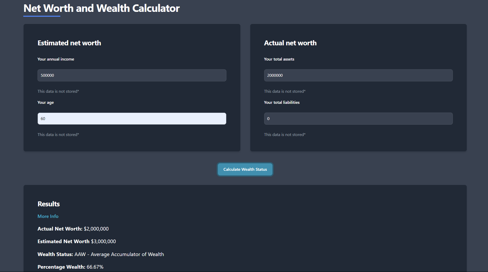

# SpendTrack

## Project Description

SpendTrack is a budgeting and expenditure insight application designed to help users manage their finances effectively. Inspired by The Millionaire Next Door by Thomas J. Stanley and built as a passion project, this
simple website helps users track their expenses, visualize them and gives insight on financial and budgeting goals.
It also features other tools such as a net worth calculator.

## Live Demo

Check out the live version of SpendTrack here: soon to be deployed stay tuned!

## Table of Contents

- [Resources](#resources-used)
- [Installation](#installation)
- [Configuration](#configuration)
- [Usage](#usage)
- [Features](#features)
- [Screenshots](#screenshots)
- [Contributing](#contributing)
- [License](#license)
- [Acknowledgments](#acknowledgments)
- [Contact Information](#contact-information)

## Resources Used

- **Front End:** React, Flowbite, Javascript, Tailwind CSS
- **Back End:** Flask, MySQL
- **Other:** Recharts, Federal Reserve Economic Data API

## Installation

1. **Clone the Repository**:

   - Visit the repository on GitHub.
   - Click the green **"Code"** button and select **"Download ZIP"**.
   - Extract the downloaded ZIP file to your desired location.

2. **Set Up SQL Server**:

   - **Install MySQL** (or your preferred SQL server):
     - Follow the installation instructions from [MySQL's official website](https://dev.mysql.com/downloads/).
   - **Create a Database**:
     - Open your SQL client (e.g., MySQL Workbench) and create a new database.
     - Make sure this database server is running

3. **Install Frontend Dependencies**:

   - Ensure you have [Node.js](https://nodejs.org/) installed.
   - Open a terminal or command prompt, navigate to the project directory, and run:
     ```shell
     npm install
     ```
   - This will install all the necessary Node.js packages for the frontend.

4. **Install Backend Dependencies**:

   - Ensure you have [Python](https://www.python.org/downloads/) installed.
   - Open a terminal or command prompt, navigate to the `backend` directory, and run:
     ```shell
     pip install -r requirements.txt
     ```
   - This will install the required Python packages for the backend.

5. **Start the Development Server**:
   - **Frontend**:
     - Run the following command in your terminal or command prompt:
       ```shell
       npm start
       ```
     - This will start the frontend on `http://localhost:3000`.
   - **Backend**:
     - In a separate terminal or command prompt, cd into the `flask-backend` directory and run:
       ```shell
       python app.py
       ```
     - This will start the backend server.

## Configuration

- Environment variables for backend:
  - In the flask-backend folder create a .env file for your database
  - Store your database user, port, name and password as needed at the top of the app.py file
  - DB_USER=user_for_your_DB, example = root
  - DB_PORT=port_for_DB
  - DB_NAME=name_for_DB
  - MYSQL_ROOT_PASSWORD=your_MYSQL_root_password
- Federal Reserve Economic Data API:

  - Sign up at [FRED](https://fred.stlouisfed.org/docs/api/fred/)
  - Request an obtain a key
  - Add FRED_KEY=your_api_key to the .env file in flask-backend

- Contact Me:
  - If you would like the contact me section to work add the following to your .env
  - MAIL_USERNAME=your_email
  - MAIL_PASSWORD=your_password

## Usage

1. After installation, access the application via `http://localhost:3000`.
2. Create/sign into an account and now it's up to you!
3. Navigate to wealth calculator or savings rate calculator to access those tools if needed
4. Go to your financial profile and input your monthly expenses via the survey
5. View the pie chart breakdown
6. Input your monthly expenses for the next or previous month and view the table's percent change
7. Look at the line chart comparing a category's expense to total expenses across months
8. Make financial goals and view in progress and completed ones and open them to see the analysis

## Features

- Profile system
- Dark/light mode support
- Net worth insight calculator
- Savings rate comparison calculator using Federal Reserve Economic Data API
- Monthly expense survey with pie chart visualization
- Set financial goals to be met or failed given survey inputs
- Line chart survey history to display monthly history on one category's expense vs. total expenses

## Screenshots

Here are some screenshots of SpendTrack in action:

### Login


### Home Page


### Settings


### Budget Breakdown Pie


### Goals Page


### Goal Results


### Expense History


### Savings Calculator Results


### Net Worth Insight



## Contributing

Contributions are welcome! Here's how you can contribute:

1. **Fork the Repository**:

   - Click the "Fork" button at the top right corner of this repository to create your own copy of the project.

2. **Clone Your Fork**:

   - Clone your forked repository to your local machine:
     ```bash
     git clone https://github.com/your-username/spendtrack.git
     ```
   - Replace `your-username` with your GitHub username.

3. **Create a Branch**:

   - Create a new branch for your feature or bug fix:
     ```bash
     git checkout -b feature/YourFeatureName
     ```
   - Make sure to use a descriptive name for your branch.

4. **Make Your Changes**:

   - Implement your changes or new features.
   - Test thoroughly to ensure everything works as expected.

5. **Commit Your Changes**:

   - Commit your changes with a meaningful commit message:
     ```bash
     git commit -m "Add feature: YourFeatureName"
     ```

6. **Push to Your Fork**:

   - Push your branch to your forked repository:
     ```bash
     git push origin feature/YourFeatureName
     ```

7. **Create a Pull Request**:

   - Go to the original repository on GitHub and create a pull request.
   - Provide a detailed description of your changes and any relevant information.

8. **Review Process**:

   - Your pull request will be reviewed, and feedback may be provided.

9. **Merge**:
   - Once your pull request is approved, it will be merged into the main branch.

## License

This project is licensed under the GNU GPL-3.0 License. See the [LICENSE](LICENSE) file for details.

## Acknowledgments

- Special thanks to the creators of [React](https://reactjs.org/), [Flask](https://flask.palletsprojects.com/), [MySQL](https://www.mysql.com/), [Tailwind CSS](https://tailwindcss.com/), [Recharts](https://recharts.org/), [Flowbite](https://flowbite-react.com/) and Thomas J. Stanley for their resources that I used in the creation of this personal project. Without these, this application would not have been possible.

## Contact Information

For questions or feedback, please contact:

- **Email**: juwang110@gmail.com
- **LinkedIn**: [My LinkedIn Profile](www.linkedin.com/in/justin-wang-209a33176)
